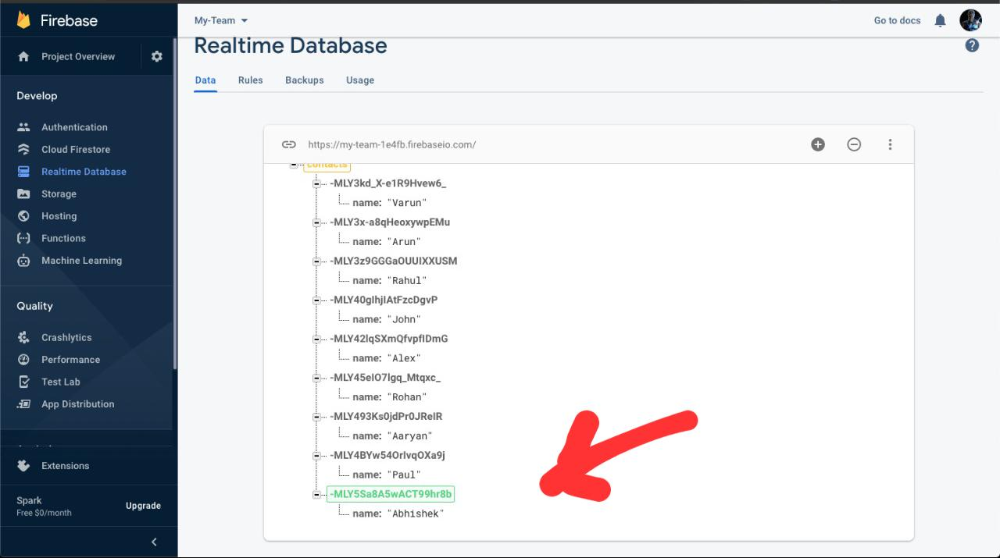
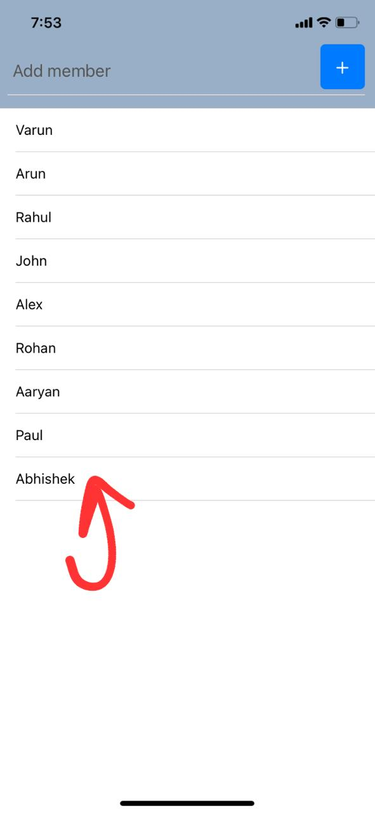

# My-Team
My Team is a mobile app where user can manage their team members by adding new members or deleting existing members.
  This app runs smoothly on both android as well as iOS devices

  The app is build mainly by using

* React-native
* Firebase
* Expo

## To run the app:
* Install Expo client app in your phone
* Install expo-cli on the system
* Run npm start and scan the QR code in the mobile app

# Snapshots

* ## Adding new member in app

* ## User added in Database

* ## User displayed in App
